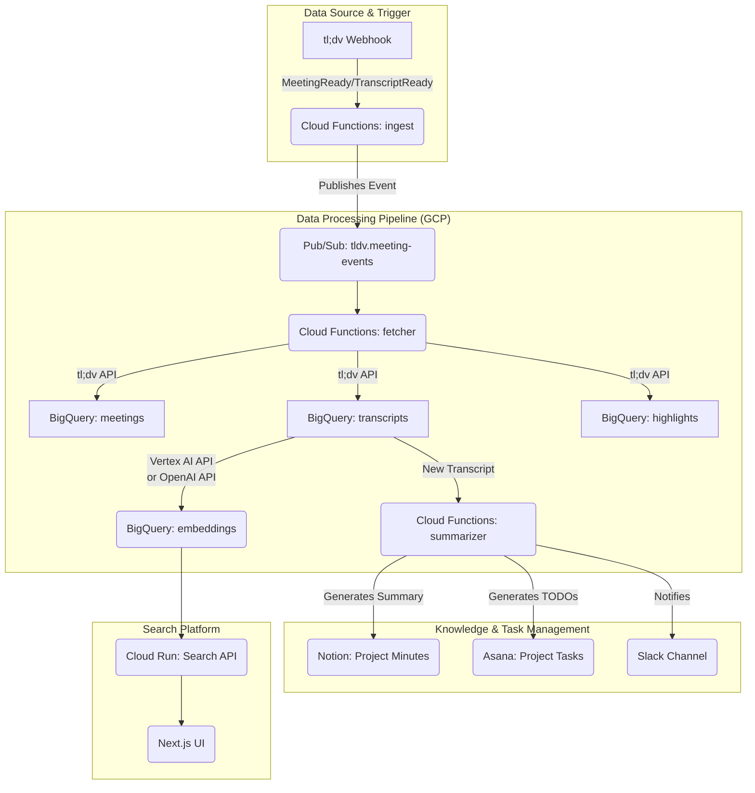

### **tl;dv × Project Knowledge Platform ― 仕様書（v1.1 / 2024-06-30）**

**はじめに**
本ドキュメントは、プロジェクトで発生するオンライン会議の情報を一元化し、検索・活用可能にするナレッジプラットフォームの最終仕様を定義するものです。tl;dvを起点としたデータパイプラインをGCP上に構築し、議事録作成、TODO管理、情報検索のプロセスを自動化・効率化します。

### **1. 背景・目的**

*   **背景:** プロジェクト横断で発生するオンライン会議の内容（録画、文字起こし、議事録、TODO）が、tl;dv, Notion, Slack, Asanaといったツール毎に散在し、情報の検索性や再利用性が低下している。必要な情報を見つけるのに時間がかかり、ナレッジが属人化している。
*   **目的:** tl;dv APIとGCPを中核技術として利用し、以下の実現を目指す。
    1.  **ナレッジの一元化:** 会議の文字起こしやハイライトをBigQueryに集約し、**プロジェクト横断での全文・ベクトル検索**を可能にする。
    2.  **プロセスの自動化:** LLMを活用し、**プロジェクト固有の名称（固有名詞）を正確に含んだ議事録サマリ**と**担当者・期日付きのTODO**を自動生成。これらをNotionやAsana、関連Slackチャンネルへ自動で展開する。
    3.  **拡張性と運用性:** イベント駆動アーキテクチャを採用し、将来的な機能拡張が容易で、かつ低運用コストなシステムを構築する。

### **2. 成果物（ゴール）**

| # | 成果物 | 完了条件 |
| :--- | :--- | :--- |
| 1 | GCPインフラ | TerraformによるIaCで、開発・本番環境のインフラが再現可能である。 |
| 2 | データパイプライン | 会議終了後、5分以内に文字起こしデータがBigQueryに格納される。 |
| 3 | 自動サマリ & TODO連携 | ・会議サマリが記載されたNotionページが生成される。<br>・抽出されたTODOがAsanaタスクとして起票される。<br>・上記成果物のリンクが関連Slackチャンネルに通知される。 |
| 4 | 横断検索プラットフォーム | React製のUIから、複数の会議を横断してキーワード検索および意味検索が可能。 |
| 5 | 監視 & コスト管理 | Cloud Monitoringで主要メトリクス（レイテンシ、エラー率、コスト）が可視化され、予算アラートが設定されている。 |

### **3. ハイレベル構成図**


*<p align="center">図1: システム全体のアーキテクチャ概要</p>*

### **4. リポジトリ構成**

```
root/
├── .github/workflows/
│   └── ci-cd.yaml         # CI/CDパイプライン (Test, Deploy)
├── infra/                 # Terraform (GCPリソース管理)
│   ├── modules/           # 再利用可能なTerraformモジュール
│   └── environments/
│       ├── dev/
│       └── prd/
├── functions/             # Cloud Functions ソースコード
│   ├── ingest/            # Webhook受信 & Pub/Sub発行
│   ├── fetcher/           # tl;dv API取得 & BigQuery格納
│   └── summarizer/        # LLMによるサマリ/TODO生成 & 各種ツール連携
├── frontend/              # Next.js + Tailwind CSS (検索UI)
└── docs/
    ├── architecture.md    # 本ドキュメント
    ├── prompt_templates/  # LLMプロンプトのテンプレート
    └── schemas/           # Notion/Asanaのデータスキーマ定義
```

### **5. 主要コンポーネント設計**

#### **5.1. GCPリソース**
| リソース | ID / 名称 | 設計・設定のポイント |
| :--- | :--- | :--- |
| プロジェクト | `proj-tldv-knowledge` | リージョンは `asia-northeast1` (東京) に統一。 |
| Service Account | `sa-tldv-functions` | 各Functionが必要とする最小権限（Least Privilege）を付与。 |
| Secret Manager | `tldv-api-key`, etc. | APIキーやTokenを管理。最新版をCloud Functions/Runにマウント。 |
| Pub/Sub | `tldv-meeting-events` | メッセージ保持期間7日。デッドレターキュー(DLQ)を設定し、処理失敗時は14日間保持。 |
| BigQuery | `knowledge_ds` | `meetings`, `transcripts`, `highlights`テーブル。`event_time`で時間分割パーティションを設定。`project_id`でクラスタリング。 |
| Cloud Functions | `ingest`, `fetcher`, `summarizer` | Gen2, Python 3.12, メモリ512MB。冪等性を担保し、重複処理を防止。**Pub/Subトリガーの場合、適切なIAM権限（`run.invoker`, `iam.serviceAccountTokenCreator`）の設定が必須。** |
| Cloud Run | `search-api` | `min-instances=0`でコスト最適化。VPCコネクタ経由で内部リソースにアクセス。 |
| Vertex AI | `Embedding API` | テキストからベクトルデータを生成。GCP内で完結しセキュア。 |

#### **5.2. 外部API & 秘匿情報**
| サービス | 用途 | Secret名 |
| :--- | :--- | :--- |
| tl;dv API | 文字起こし・メタデータ取得 | `TLDV_API_KEY` |
| tl;dv Webhook | イベント受信 | `TLDV_SIGNING_SECRET` |
| OpenAI API | GPT-4oによるサマリ生成 | `OPENAI_API_KEY` |
| Notion API | 議事録ページ作成 | `NOTION_API_TOKEN` |
| Asana API | TODOタスク作成 | `ASANA_PAT` |
| Slack API | 結果通知 | `SLACK_BOT_TOKEN` |

#### **5.3. LLMプロンプト戦略**
*   **固有名詞対応:** サマリ生成の精度向上のため、以下の情報をプロンプトに動的に含めます。
    *   **参加者名:** tl;dvの会議メタデータから取得。
    *   **プロジェクト名・専門用語:** Notionの特定DBやドキュメントから事前に取得した用語リスト。
*   **出力形式の制御:** JSONモードを利用し、サマリ、Action Item、Key Decisionを構造化データとして出力させ、後続処理の安定性を高めます。

### **6. フェーズ別タスク & DoD (Definition of Done)**

#### **0️⃣ ベースセットアップ（Day 0–1）**
| ID | Task | DoD |
| :--- | :--- | :--- |
| 0-1 | GCPプロジェクト & Secret設定 | Terraformで基本リソースが作成され、Secret Managerに全APIキーが登録済み。 |
| 0-2 | GitHubリポジトリ & WIF設定 | リポジトリとWorkload Identity Federationが設定され、GitHub ActionsからGCP認証が可能。 |

#### **1️⃣ Webhookインジェスト & データ取込（Day 1–5）**
| ID | Task | DoD |
| :--- | :--- | :--- |
| 1-1 | `ingest` Function開発 | HMAC署名を検証し、不正なリクエストを弾ける。正常なイベントをPub/SubにPublishできる。 |
| 1-2 | `fetcher` Function開発 | Pub/Subトリガーで起動。tl;dv APIから3種のリソースを取得し、BigQueryにUpsertできる。**Webhookペイロードの`data.meetingId`を正しく使用すること。** 冪等性が担保されている。 |
| 1-3 | DLQ & アラート設定 | `fetcher`での処理失敗時にイベントがDLQに送られ、Slackにアラートが通知される。 |

#### **2️⃣ LLM連携 & ナレッジ自動生成（Week 2）**
| ID | Task | DoD |
| :--- | :--- | :--- |
| 2-1 | `summarizer` Function開発 | BigQueryの新規データ挿入をトリガーに起動。LLMでサマリとTODOリスト(JSON)を生成できる。 |
| 2-2 | Notion/Asana連携 | 生成されたサマリでNotionページを作成。TODOをAsanaタスクとして担当者・期日付きで作成。重複作成を防止する。 |
| 2-3 | Slack通知連携 | 生成されたNotionとAsanaのリンクを、会議情報と共にSlackの関連チャンネルへ通知できる。 |

#### **3️⃣ 検索プラットフォーム開発（Week 3–4）**
| ID | Task | DoD |
| :--- | :--- | :--- |
| 3-1 | Embedding生成パイプライン | BigQueryの新規`transcripts`に対し、自動でEmbeddingを計算し、`embedding`カラムに格納する。 |
| 3-2 | `search-api` (Cloud Run)開発 | `/search?q=...`エンドポイントが意味検索（ベクトル検索）とキーワード検索の結果をJSONで返す。 |
| 3-3 | フロントエンドUI開発 | Next.jsで検索画面を実装。プロジェクト横断で検索でき、結果（会議名、発言箇所、リンク）を一覧表示できる。 |

#### **4️⃣ 運用・改善（並行）**
| ID | Task | DoD |
| :--- | :--- | :--- |
| 4-1 | モニタリングダッシュボード構築 | Latency/Error/Cost/BQ Slot使用率が一覧できるダッシュボードが完成している。 |
| 4-2 | IAM権限監査 | 各Service Accountの権限が必要最小限であることを確認し、監査ログに記録する。 |

### **7. CI/CD**
GitHub Actionsを利用し、`main`ブランチへのPushをトリガーにテストとデプロイを自動化します。認証には**Workload Identity Federation**を使用し、サービスアカウントキーの直接利用を避けます。

```yaml
# .github/workflows/ci-cd.yaml (抜粋)
name: CI/CD for Cloud Functions
on:
  push:
    branches: [ main ]

jobs:
  deploy-functions:
    runs-on: ubuntu-latest
    permissions:
      contents: 'read'
      id-token: 'write' # WIFに必要
    strategy:
      matrix:
        function: [ingest, fetcher, summarizer] # 全Functionを対象
    steps:
      - uses: actions/checkout@v4
      - name: Authenticate to Google Cloud
        uses: google-github-actions/auth@v2
        with:
          workload_identity_provider: 'projects/123456789/locations/global/workloadIdentityPools/my-pool/providers/my-provider'
          service_account: 'sa-tldv-functions@proj-tldv-knowledge.iam.gserviceaccount.com'
      - name: Deploy Cloud Function
        uses: google-github-actions/deploy-cloud-functions@v2
        with:
          name: ${{ matrix.function }}
          runtime: python312
          source_dir: functions/${{ matrix.function }}
          entry_point: main
          # ...その他の設定
```

### **8. テスト方針**
*   **単体テスト:** `pytest`を使用。各Functionのビジネスロジック（API連携、データ変換など）を網羅。
*   **結合テスト:** ローカルエミュレータ（Functions, Pub/Sub）とサンドボックス用GCPプロジェクトを使用し、`ingest`から`summarizer`までの流れを検証。
*   **E2Eテスト:** tl;dvのサンドボックス機能でテスト会議を実施後、最終的にNotion、Asana、Slackに成果物が正しく生成されるかを検証するワークフローを定期実行（nightly）。

### **9. リスクと対策**
| リスク分類 | 具体的なリスク内容 | 対策 |
| :--- | :--- | :--- |
| **外部API** | ・API仕様変更による機能停止<br>（例: Webhookペイロードの構造変更 `id` vs `meetingId`）<br>・レートリミット超過<br>・一時的な障害（404エラーなど） | ・各APIクライアントを疎結合に実装し、変更時の影響範囲を限定。<br>・指数バックオフ付きのリトライ処理を実装。<br>・サーキットブレーカーパターンの導入を検討。 |
| **LLM** | ・出力品質のばらつき、幻覚<br>・意図しない高コスト化 | ・プロンプトをバージョン管理し、改善プロセスを確立。<br>・出力形式をJSON Schemaでバリデーション。<br>・API usageを詳細にモニタリングし、トークン数に上限を設定。 |
| **GCP/インフラ** | ・IAM権限設定の不足によるサービス間連携の失敗 | ・TerraformでIAMポリシーをコード管理する。<br>・Pub/Subトリガーの場合、対象Functionのサービスアカウントに`run.invoker`ロール、Pub/Subのサービスアカウントに`iam.serviceAccountTokenCreator`ロールが必要。 |
| **セキュリティ** | ・会議内容に機微情報が含まれる | ・アクセス制御を厳格化（IAM, VPC-SC）。<br>・PII（個人を特定できる情報）を検出・マスキングする処理の導入を検討。 |

---